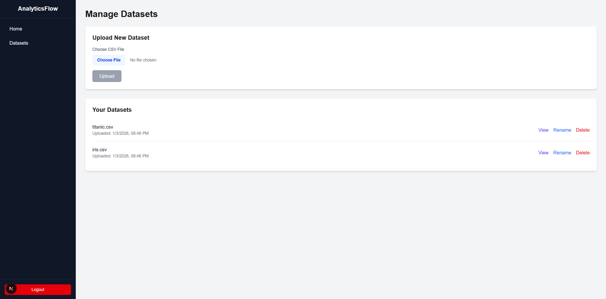
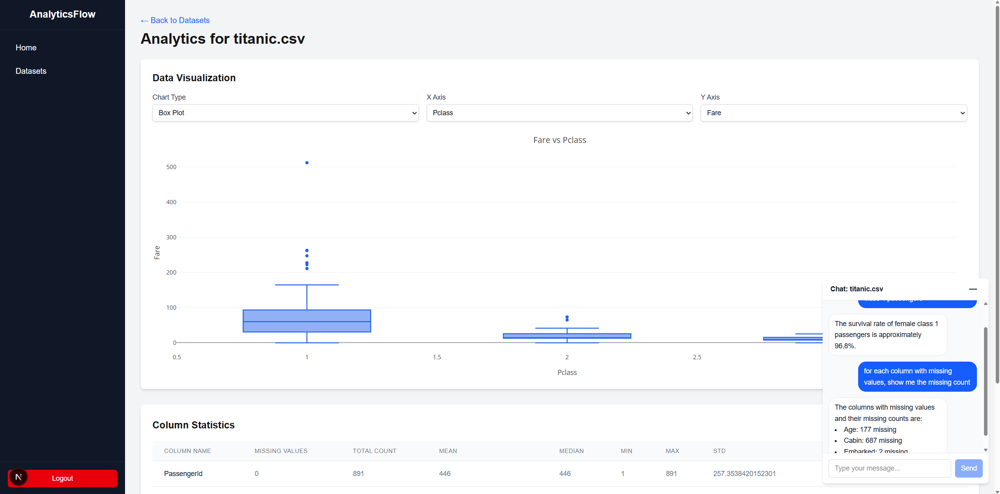

# Analytics Flow

A full-stack app for uploading CSVs, viewing quick dataset analytics, and chatting with an AI agent about your dataset.

## Screenshots





## Features

- Email/password auth (JWT)
- Upload CSVs and manage your files
- Dataset analytics summary endpoints (column stats + preview data)
- Dataset chat endpoint backed by a pandas DataFrame agent
- Chat widget renders Markdown responses (tables/lists/code via GFM)

## Project Layout

```
.
├─ backend/                 # FastAPI app
│  ├─ main.py               # App entrypoint, CORS, router wiring
│  ├─ routers/              # API routes: auth, files, analytics (incl. chat)
│  ├─ chat_agent.py         # LangChain pandas DataFrame agent (cached sessions)
│  ├─ database.py           # SQLAlchemy engine/session
│  ├─ models.py             # ORM models
│  ├─ schemas.py            # Pydantic schemas
│  ├─ tests/                # Backend tests
│  ├─ uploads/              # Stored CSV files (bind-mounted in Docker)
│  ├─ requirements.txt
│  └─ .env.example          # Example backend env vars
├─ frontend/                # Next.js app (App Router)
│  ├─ app/                  # Routes: /, /login, /register, /upload, /analytics/[id]
│  ├─ components/           # UI components (incl. ChatWidget)
│  └─ package.json
├─ db/                      # Postgres init SQL
├─ screenshots/             # README images
├─ scripts/                 # Local lint/test helpers
├─ docker-compose.yml
└─ Makefile
```

## Prerequisites

- Docker + Docker Compose
- If running the frontend locally: Node.js >= 22 (see frontend/package.json)

## Quickstart (Docker)

1. Create backend env file:

   ```bash
   cp backend/.env.example backend/.env
   ```

2. (Optional) Enable dataset chat:

   The chat endpoint uses `langchain-openai` and requires `OPENAI_MODEL` and `OPENAI_API_KEY` in `backend/.env`.
   If these are missing, the rest of the app will still run, but the chat endpoint will return an error.

3. Start services:

   ```bash
   docker-compose up -d --build
   ```

   Or via Makefile:

   ```bash
   make build
   make up
   ```

4. Open:

- Frontend: http://localhost:3000
- Backend API: http://localhost:8000
- API docs (Swagger): http://localhost:8000/docs

## Development

### Useful Commands

- `make logs` / `make restart` / `make down`
- `make clean` (drops volumes; resets the DB)
- `make test-backend` (runs pytest inside the backend container)

### Local lint and tests (no Docker)

- `./scripts/lint.sh`
- `./scripts/test.sh`

## Notes

- Uploaded files are stored under `backend/uploads/`.
- The database schema is initialized from `db/init.sql` and persisted in the `postgres_data` Docker volume.
